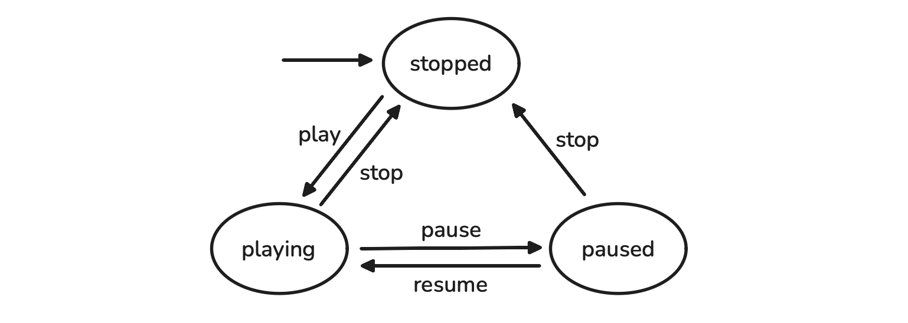
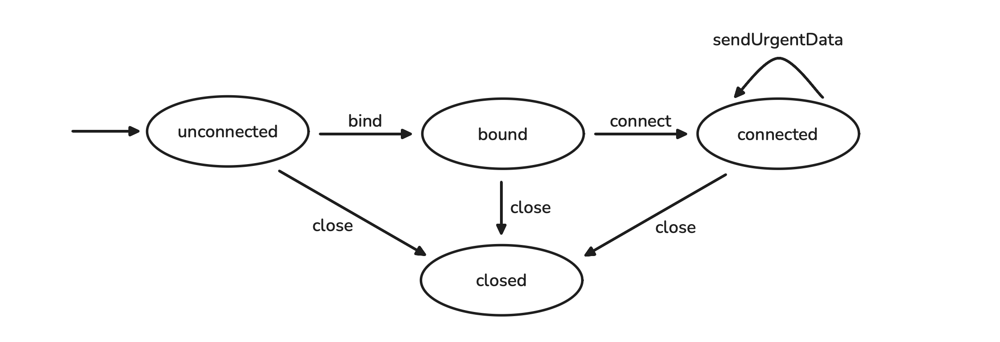

# LiquidJava Tutorial

Made by [Ricardo Costa](https://github.com/rcosta358) and [Catarina Gamboa](https://catarinagamboa.github.io)

### What are Liquid Types?

Programs go wrong. Developers make mistakes. What if we could catch more bugs before the program even runs? Traditional type systems help us achieve this. For example, strongly typed programming languages, like Java, don't allow us to assign a string to an integer variable. But what if we could have stronger guarantees? What if we want an integer variable to always be positive? Or within a certain range?

**Liquid types** make this possible. They extend traditional type systems by allowing us to refine types with logical predicates. This means that we can specify more precise properties about our programs. This allows us to catch errors earlier in the development process. These include division by zero, array out-of-bounds access and protocol violations.

Let's look at an example. Consider the following Java code:

```java
public class Example {

    public static int divide(int a, int b) {
        return a / b;
    }

    public static void example() {
        int result = divide(2, 0); // division by zero exception at runtime!
    }
}
```

Wouldn't it be great to specify that the parameter `b` of the `divide` method should never be zero, in the same way that it specifies that it should never be a `String`? 

### Introducing LiquidJava

LiquidJava is an implementation of a liquid type checker for Java. It allows developers to add specifications to their code using Java annotations.

Let's see how we can improve the previous code using LiquidJava:

```java
public class Example {

    public static int divide(int a, @Refinement("b != 0") int b) {
        return a / b;
    }

    public static void example() {
        int result = divide(2, 0); // compile error! b cannot be zero!
    }
}
```

Notice that the method `divide` now requires the parameter `b` to be non-zero. If we try to call `divide` with a zero value for `b`, LiquidJava will raise a type error at compile time, preventing the division by zero exception.

### Getting Started with LiquidJava

To follow along with this tutorial, make sure you have the following installed:

- Visual Studio Code, for editing the code and using the LiquidJava extension
- [Java Extension Pack by Red Hat](vscode:extension/redhat.java), which provides Java support in VS Code
- [LiquidJava Extension](vscode:extension/AlcidesFonseca.liquid-java), which provides the LiquidJava typechecker with real-time error reporting and syntax highlighting for the refinements.

### Important!

Currently, **only one error is reported at a time**, so an error might not be reported if another one is present! In each part of the tutorial, **make sure to fix all errors before moving on to the next one**. Also, if you think the extension isn't working correctly, try restarting the extension with the command palette (`Cmd+Shift+P` or `Ctrl+Shift+P`) and selecting `Developer: Restart Extension Host`.

---

## Tutorial

### 1. Basic Refinements

First of all, let's explore how basic refinements work in LiquidJava.

> Open [RefinementsExample.java](./src/main/java/com/tutorial/part1/RefinementsExample.java)

Here you can find three variables, `positive`, `nonzero` and `percentage`, with comments containing the refinements that should be used in each one. Remember that only one can be shown at a time. Notice that `_` can also be used as a placeholder for the variable name in the refinement expression, as shown in the refinement for the `percentage` variable.

> Now, one by one, uncomment the `@Refinement` annotations and observe each error reported. Then, change each value to satisfy the corresponding refinement — change the value of `positive` to a positive integer, the value of `nonzero` to any non-zero integer, and the value of `percentage` to an integer between `0` and `100`.

As demonstrated previously, we can also refine method parameters and return values.

> Open [MethodRefinementExample.java](./src/main/java/com/tutorial/part1/MethodRefinementExample.java).

Here, the method `divide` is refined to ensure that the parameter `b` is never zero.

> Try changing the value of the second argument in the `divide` method call to zero and observe the error reported by LiquidJava. Now change it back to a non-zero value.

But wait, we can also refine the return value of the method! Let's introduce a bug.

> Change the implementation of the `divide` method to return `a - b` instead of `a / b`.

No error! Let's fix this.

> Above of the method signature, add the following refinement to specify that the return value should be exactly equal to the division of `a` by `b`:

```java 
@Refinement("_ == a / b")
```

Now we get an error! LiquidJava is telling us that the implementation of the method does not satisfy the refinement specified for the return value. This way, we can catch errors not only in the inputs of the methods, but also in their outputs.

> Fix the implementation of the method to return `a / b` again to make the error disappear.

#### Exercise

> Open [Bank.java](./src/main/java/com/tutorial/part1/exercise/Bank.java).

This class simulates a simple bank account with two methods: `deposit` and `withdraw`. In the `main` method, we simulate a wrong usage of the `deposit` and `withdraw` methods of a bank account, since it tries to withdraw more money than the current balance. Let's make use of LiquidJava refinements to ensure the correct usage of these methods.

> Replace the `"true"` refinements with the appropriate ones to ensure the correct behavior of both methods.

For example, we want to ensure that the `balance` and `amount` parameters of both methods are equal or greater than zero and greater than zero, respectively. Also, we want to ensure the correct implementation of both methods — they must return the updated balance after the deposit or withdrawal operations. This also tells the typechecker what the expected output is, allowing it to verify the correctness of the following operations.

With the correct refinements in place, LiquidJava will report an error in the `withdraw` method call, since it tries to withdraw more money than it was deposited. If we instead try to withdraw `10` or less, no error will be reported.

However, notice that we are repeating the same refinement twice in the `balance` parameter of both methods. For this, we can use a refinement aliases to define commonly used refinements and avoid repetition.

> Add the following lines of code above the class definition:

```java
import liquidjava.specification.RefinementAlias;

@RefinementAlias("NonNegative(int v) { v >= 0 }")
```

> Then, replace all occurrences of `@Refinement("_ >= 0")` with `@Refinement("NonNegative(_)")`.

The refinements are now easier to understand, while still providing the same guarantees!

### 2. State Refinements

Let's explore how to use **state refinements** to specify and verify properties about the state of an object.

> Open [LightBulb.java](./src/main/java/com/tutorial/part2/LightBulb.java).

Here, we specify that this object can only be in two states: `on` or `off`. Then, in the constructor, we specify that the initial state is `off`, through the `@StateRefinement` annotation. This annotation allows us to specify in which state the object should be before the method is called (`from`), and in which state it will be after the method execution (`to`). In the constructor, since it's the first method to be called, we can only specify the `to` state.

This object has two methods, `turnOn` and `turnOff`. From the state refinements, we can see that the method `turnOn` can only be called when the object is in state `off` transiting to state `on`. Similarly, the method `turnOff` can only be called when the object is in state `on`, transiting to state `off`. This means that we cannot call the same method twice in a row, since it would violate the protocol established by the state refinements. The following DFA illustrates this:


> Uncomment line 22 to observe the error and then comment it back again.

#### Exercise

> Open [MediaPlayer.java](./src/main/java/com/tutorial/part2/exercise/MediaPlayer.java). Your task is to replace the `"true"` refinements with the appropriate ones to ensure the correct behavior of the `play`, `pause`, `resume` and `stop` methods, using the `stopped`, `playing`, and `paused` states.

For example, we want to ensure that the `pause` method can only be called when the player is playing, and that the `stop` method can only be called when the player is not stopped (you can either use the `!` or the `||` operator for this). The state transitions are represented by the following DFA:



With the correct implementation, LiquidJava will report an error in line 30, since we are trying to resume playback when the player is stopped.

### 3. External Refinements

To demonstrate the state refinements in a real world scenario, let's learn about **external refinements**. LiquidJava allows us to refine external classes, such as classes from the Java standard library. For instance, we can refine the `Socket` class to ensure its correct usage. 

> Open [SocketRefinements.java](./src/main/java/com/tutorial/part3/SocketRefinements.java).

Here, we refine the `Socket` class through state refinements, with the possible states being `unconnected`, `bound`, `connected`, and `closed`. Then, for each method, we specify the allowed state transitions. This way, we can ensure that, for example, the `connect` method can only be called after the `bind` method, and that the `close` method can only be called once. The following DFA details the allowed state transitions:



> Open [SocketExample.java](./src/main/java/com/tutorial/part3/SocketExample.java).

Here, we see a simple usage of the `Socket` class. If you comment out the line 9 containing with the `bind` method call, LiquidJava will report an error in the `connect` method call, since it violates the state refinement specified for the `Socket` class! Notice that when using the `Socket` class, we don't need to deal with any refinement annotations, since they are already specified in the external refinement interface.


#### Exercise

Let's refine another external class.

> Open [ReentrantLockRefinements.java](./src/main/java/com/tutorial/part3/exercise/ReentrantLockRefinements.java). Your task is to replace the `"true"` refinements with the appropriate ones to refine the `ReentrantLock` class.

We want to ensure that the `lock` method can only be called in the `unlocked` state, and that the `unlock` method can only be called in the `locked` state. These transitions are represented by the following DFA:


With the correct implementation, LiquidJava will report an error in line 10 of [ReentrantLockExample.java](./src/main/java/com/tutorial/part3/exercise/ReentrantLockExample.java), since we are trying to unlock a lock that is not locked.


### 4. Ghost Variables

Finally, LiquidJava also offers a way to model objects using **ghost variables** through the `@Ghost` annotation, which are used to track additional information about the program's state when states aren't enough. These can be, for instance, counters (integers) or flags (booleans), to model more complex protocols.

> Open [ArrayListRefinements.java](./src/main/java/com/tutorial/part4/ArrayListRefinements.java).

Here, we define the refinements for the `ArrayList` class, using a ghost variable `size` to keep track of the number of elements in the list. Using the `size` ghost variable in state refinements, we can prevent out-of-bounds access.

In the constructor, we specify that after it is called, the ghost variable `size` will be equal to `0`. This is optional since its default value is already zero, but it helps us understand this example. Then, in the `add` method, we specify that it can be called in any state (since we don't specify a `from` state), and that after it is called, the `size` ghost variable will be incremented by one — the new size will be equal to the old size plus one (`old` is a special keyword that refers to the previous state of the object, so calling `size(old(this))` gets the value of `size` before the method was called). Finally, in the `get` method, we specify that the index parameter must be non-negative and less than the current size of the list, therefore preventing out-of-bounds errors.

The state transitions are represented by the following DFA:

> Open [ArrayListExample.java](./src/main/java/com/tutorial/part4/ArrayListExample.java).

Here, we can see a simple usage of the refined `ArrayList` class. If you uncomment line 11, LiquidJava will report an error, since we are trying to access an index that is out of bounds!

#### Exercise

Let's do the same but for the `Stack` class.

> Open [StackRefinements.java](./src/main/java/com/tutorial/part4/exercise/StackRefinements.java). Your task is to refine the `Stack` class by replacing the `"true"` refinements with the appropriate ones to ensure the correct behavior of the `push`, `pop` and `peek` methods, using the `count` ghost variable to keep track of the number of elements in the stack, and not allow incorrect uses of these methods — popping or peeking from an empty stack.

With the correct implementation, LiquidJava will report an error in line 11 of [StackExample.java](./src/main/java/com/tutorial/part4/exercise/StackExample.java), since we are trying to pop an element of the stack when it is empty.

---

# References

- [LiquidJava Website](https://catarinagamboa.github.io/liquidjava.html)
- [LiquidJava External Libraries Repository](https://github.com/CatarinaGamboa/liquid-java-external-libs)
- [LiquidJava Examples Repository](https://github.com/CatarinaGamboa/liquidjava-examples)
- [LiquidJava Repository](https://github.com/CatarinaGamboa/liquidjava)
- [LiquidJava VS Code Extension Repository](https://github.com/CatarinaGamboa/vscode-liquidjava)
